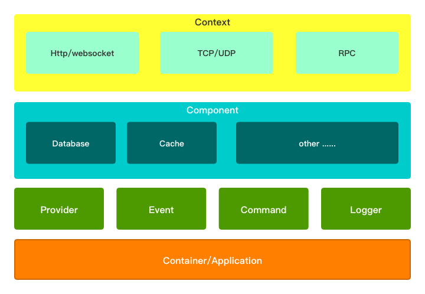

## 简介

### `Firmeve`框架的诞生


### 为什么要开发这个框架


## 基础示例

```go
package main

import (
	"github.com/firmeve/firmeve"
	"github.com/firmeve/firmeve/kernel"
	"github.com/firmeve/firmeve/kernel/contract"
	"github.com/firmeve/firmeve/render"
	"net/http/pprof"
)

type App struct {
	kernel.BaseProvider
}

func (a *App) Name() string {
	return `app`
}

func (a *App) Register() {
}

func (a *App) Boot() {
	router := a.Firmeve.Get(`http.router`).(contract.HttpRouter)
	v1 := router.Group("/api/v1")
	{
		v1.GET(`/ping`, func(c contract.Context) {
			c.RenderWith(200, render.JSON, map[string]string{
				"message": "pong",
			})
			c.Next()
		})
	}
	debug := router.Group("/debug")
	{
		debug.Handler("GET", "/pprof", pprof.Index)
		debug.Handler("GET", "/cmdline", pprof.Cmdline)
		debug.Handler("GET", "/profile", pprof.Profile)
		debug.Handler("GET", "/symbol", pprof.Symbol)
		debug.Handler("GET", "/trace", pprof.Trace)
	}
}

func main() {
	firmeve.RunDefault(firmeve.WithProviders(
		[]contract.Provider{
			new(App),
		},
	))
}

```

运行`main`

```bash
go run main.go -c config.yaml http:serve
```


## 基础架构




## 生命周期

todo ....

在 Main 中我们需要执行`firmeve.Run`或者`firmeve.RunDefault`函数，并且进行 Provider 和 Command 挂载


## 后续开发计划

